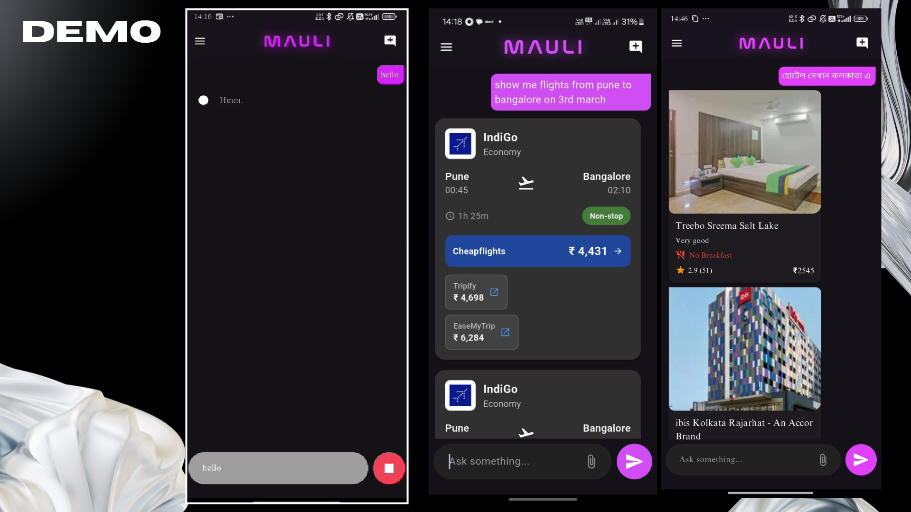
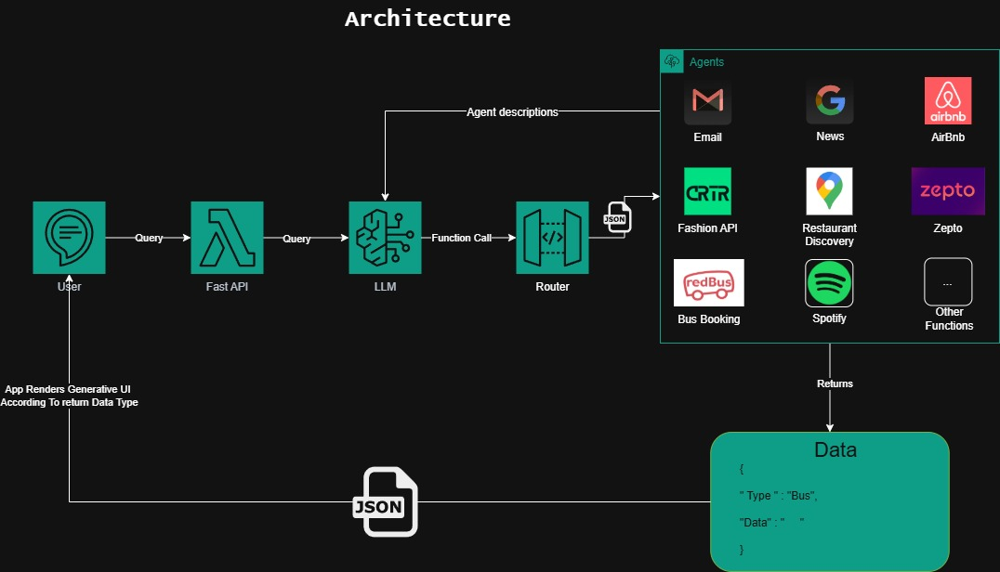
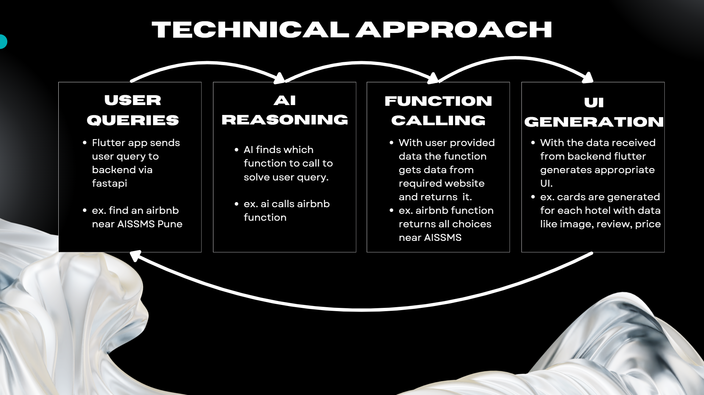
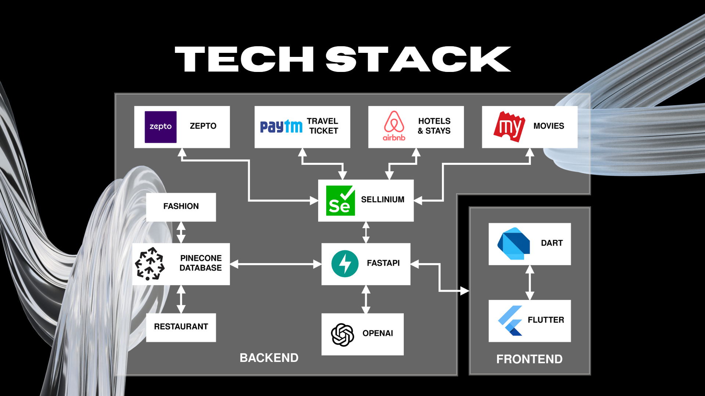

# Athena(Mauli): The Free Open-Source Alternative to Alexa+ and Perplexity

Athena is an open-source AI assistant designed to execute complex tasks across multiple services with natural language understanding—something Alexa+ and Perplexity can't fully deliver. While Alexa+ focuses on premium voice-command experiences and Perplexity excels at answering queries with AI, Athena bridges the gap by combining deep context awareness with full-service integration for real-world tasks.




## Beyond Voice Commands: A Truly Intelligent Assistant

Athena is built to be what modern digital assistants should have been. Unlike Alexa+—which is typically locked into a specific ecosystem—and Perplexity—designed mainly as a query-answering tool—Athena can:

- **Understand Complex Contexts:** Process multi-step, nuanced requests and remember conversation history.
- **Execute Integrated Tasks:** Carry out tasks that span across various services (e.g., travel, entertainment, food, and shopping) in one seamless interaction.
- **Connect to the Services You Use:** Directly interface with platforms such as Airbnb, Spotify, and local restaurants without forcing you to switch between multiple apps.
- **Stay Completely Free:** Enjoy a robust, open-source solution without hidden fees or subscription requirements.

---

## How Athena Stands Out

### Comparison with Alexa+ and Perplexity

| **Feature**                | **Alexa+**                                               | **Perplexity**                                  | **Athena**                                                       |
|----------------------------|----------------------------------------------------------|-------------------------------------------------|------------------------------------------------------------------|
| **Natural Language**       | Handles basic commands with limited contextual support   | Excels at answering questions but isn't built for action execution | Understands and processes complex, multi-step commands             |
| **Context Awareness**      | Limited conversation memory                              | Provides query-specific context only            | Maintains full conversation context across multi-step tasks       |
| **Task Execution**         | Generally supports single, isolated tasks                | Not designed for integrated task execution      | Executes complex, multi-step tasks that span multiple services      |
| **Service Integration**    | Primarily tied to the Amazon ecosystem                   | Lacks direct integration with external services | Open integration with popular services (Airbnb, Spotify, etc.)      |
| **Cost**                   | Subscription-based premium features                      | Free but limited to search/QA functions           | Completely free and open-source, with no premium tier                |
| **Customizability**        | Limited by proprietary ecosystem                         | Minimal customization available                 | Fully customizable and independent from proprietary constraints     |

Athena's holistic design ensures that whether you need to plan a trip, book tickets, or manage your daily tasks, the assistant is equipped to handle it all—without the limitations found in other platforms.

---

## What You Can Actually Ask Athena To Do

Imagine being able to say:

> "I need a weekend getaway. Find me an Airbnb in Goa for next Friday to Sunday, book bus tickets for two people, and recommend some nearby restaurants."

Instead of simply suggesting you open different apps or search online, Athena will:

- Analyze your request as a single cohesive command.
- Communicate with multiple services to fetch real-time data.
- Execute bookings and reservations seamlessly.
- Present you with a unified, dynamic interface showcasing your options.

---

## Architecture

Athena is powered by a robust, modular architecture comprising four core components:




1. **User Query Processing**
   - The mobile app (built with Flutter) sends natural language queries to the backend via FastAPI.
   - *Example:* "Find an Airbnb near AISSMS Pune."

2. **AI Reasoning**
   - Utilizes OpenAI's GPT-4 for advanced reasoning and function calling, determining which actions to take based on the query.

3. **Function Calling**
   - Executes specific functions by fetching data from integrated services (e.g., Airbnb for accommodations).
   - Returns structured data that Athena can process further.

4. **Dynamic UI Generation**
   - The Flutter frontend renders a clean, intuitive UI—displaying results as cards complete with images, reviews, and prices.



---

## Tech Stack



**Backend:**
- **OpenAI (GPT-4):** For advanced reasoning and function calling.
- **FastAPI:** To create robust API endpoints.
- **Selenium:** For automated web interactions.
- **PineCone Database:** For efficient data storage and retrieval.

**Frontend:**
- **Flutter/Dart:** For cross-platform mobile app development.

**Services Integration:**
- **Travel:** Airbnb, Paytm Travel, Bus Booking services.
- **Entertainment:** Spotify, Movies (via BookMyShow).
- **Food:** Restaurant Discovery, Zepto Delivery.
- **Shopping:** Fashion API, Amazon.
- **Utilities:** Email, Google Search, and more.

---

## Setup and Installation

1. **Clone the repository:**
   ```bash
   git clone https://github.com/yourusername/athena.git
   ```

2. **Install dependencies:**
   ```bash
   pip install -r requirements.txt
   ```

3. **Set up environment variables:**
   
   Create a `.env` file and add:
   ```env
   OPENAI_API_KEY=your_openai_api_key
   PINECONE_API_KEY=your_PINECONE_API_KEY
   PINECONE_HOST_URL=your_PINECONE_HOST_URL
   PRELEXITY_API_KEY=your_PRELEXITY_API_KEY
   SPOTIFY_CLIENT_ID=your_SPOTIFY_CLIENT_ID
   SPOTIFY_CLIENT_SECRET=your_SPOTIFY_CLIENT_SECRET
   SPOTIFY_REDIRECT_URI=http://localhost:8888/callback

   ```

4. **Run the FastAPI server:**
   ```bash
   uvicorn main:app --reload --port 3000
   ```

4. **Get The Flutter App from Frontend Repo:**

    [Flutter](https://github.com/h4636oh/athena-the-assistant)

---

## How It Works


1. **Natural Language Input:** The user sends a query through the mobile app.
2. **Backend Processing:** The backend uses OpenAI's capabilities to interpret the query.
3. **Function Execution:** Based on the reasoning, the appropriate function is called to interact with the necessary service.
4. **Data Retrieval:** Information is fetched in a structured format.
5. **UI Rendering:** The app dynamically creates UI elements (cards, lists, etc.) to display the results.

---

## Features

- **Multi-service Integration:** Book hotels, order food, play music, find restaurants, and more—all in one go.
- **Context Awareness:** Retains conversation history for more personalized and relevant responses.
- **Natural Language Understanding:** Processes complex queries and executes integrated multi-step tasks.
- **Dynamic UI Generation:** Automatically creates interfaces based on the structured data returned from service calls.
- **Customizability:** Fully open-source and customizable to suit various use cases.

---

## Usage Examples

- **Travel:** "Find an Airbnb near AISSMS Pune for this weekend."
- **Transportation:** "Book a bus ticket from Mumbai to Pune for tomorrow."
- **Shopping:** "Order groceries from Zepto—add milk, eggs, and bread."
- **Entertainment:** "Play my favorite playlist on Spotify."
- **Communication:** "Send an email to my team about the project deadline."

---

## Contributing

We welcome contributions to make Athena even better. To get started:

1. **Fork the repository.**
2. **Create a feature branch:**
   ```bash
   git checkout -b feature/amazing-feature
   ```
3. **Commit your changes:**
   ```bash
   git commit -m 'Add an amazing feature'
   ```
4. **Push to the branch:**
   ```bash
   git push origin feature/amazing-feature
   ```
5. **Open a Pull Request.**

---

## License

This project is licensed under the MIT License – see the [LICENSE](./LICENSE) file for details.

---

## Code Structure

Athena follows a modular, maintainable code architecture focused on separation of concerns:

```
athena/
├── config.py                # Centralized configuration settings
├── functioncalling.py       # OpenAI API integration for function calling
├── main.py                  # FastAPI server and request handling
├── router.py                # Function routing and dispatch system
├── tools.json               # Tool definitions for LLM function calling
├── utils.py                 # Shared utility functions
├── requirements.txt         # Project dependencies
├── Movies/                  # Entertainment service integrations
├── webserch/                # Web search capabilities
├── restaurant/              # Restaurant-related services
├── Hotel/                   # Hotel booking services
├── flightCompare/           # Flight search and booking
├── zepto/                   # Grocery delivery integration
├── emailAutomation/         # Email services
└── ...                      # Other service integrations
```

The code is organized with the following principles:

1. **Modular Design**: Each service has its own module with clear responsibilities
2. **Consistent Error Handling**: Standardized error responses throughout the application
3. **Centralized Configuration**: All settings managed in one place for easier updates
4. **Comprehensive Logging**: Detailed logging for better debugging and monitoring
5. **Type Hints**: Python type annotations for improved code quality and IDE support
6. **Clear Documentation**: Docstrings and comments explaining functionality

This architecture makes the codebase more maintainable, testable, and easier to extend with new capabilities.

Athena is more than just another AI assistant—it's a complete reimagination of what digital assistance can be. By integrating complex task execution with seamless service connectivity and deep natural language understanding, Athena not only outperforms Alexa+ and Perplexity but also paves the way for the future of AI-powered digital assistance.

Feel free to explore, contribute, and help shape the future of Athena!

## Demo Applications

### Streamlit Web Interface

Athena includes a Streamlit-based web interface for easy interaction with the virtual assistant. To run the demo:

1. Install the additional requirements:
   ```bash
   pip install -r requirements.txt
   ```

2. Start the FastAPI backend server:
   ```bash
   uvicorn main:app --reload --port 3000
   ```

3. In a new terminal, start the Streamlit interface:
   ```bash
   streamlit run streamlit_app.py
   ```

The Streamlit interface provides:
- A clean, modern chat interface
- Example queries and capabilities
- Real-time responses from Athena
- Chat history management
- Easy-to-use input system

This demo makes it easy to test and showcase Athena's capabilities without needing to use the mobile app.